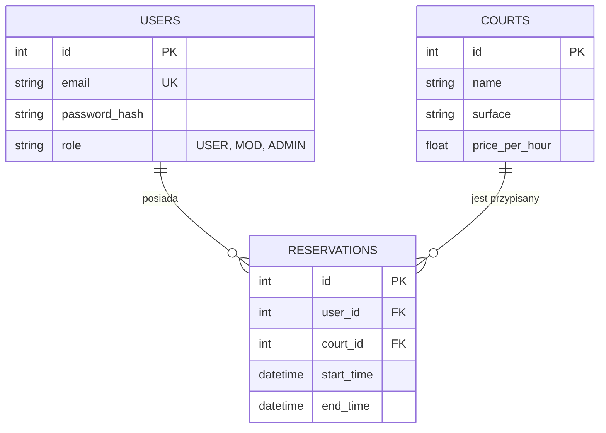

# Dokumentacja Projektowa — System TennisCourts

## 1. Wymagania Funkcjonalne

Aplikacja "TennisCourts" służy do zarządzania rezerwacjami kortów tenisowych. System oferuje różne funkcjonalności w zależności od roli użytkownika:

*   **Użytkownik Niezalogowany (Gość):**
    *   Przeglądanie listy dostępnych kortów.
    *   Podgląd szczegółów kortu (nawierzchnia, cena).
    *   Podgląd aktualnej pogody w lokalizacji obiektu.
*   **Gracz (Zalogowany USER):**
    *   Rezerwacja wybranego kortu w określonym przedziale czasowym.
    *   Automatyczne sprawdzanie kolizji (brak możliwości rezerwacji zajętego kortu).
    *   Podgląd własnej listy rezerwacji.
*   **Moderator (MOD):**
    *   Podgląd wszystkich rezerwacji w systemie.
    *   Możliwość odwoływania rezerwacji użytkowników.
*   **Administrator (ADMIN):**
    *   Zarządzanie katalogiem kortów (dodawanie, edycja, usuwanie).
    *   Pełny wgląd w listę użytkowników i ich uprawnienia.

---

## 2. Architektura Systemu

System został zbudowany w architekturze rozproszonej (Fullstack):

*   **Frontend:** React (Vite) + Tailwind CSS. Hostowany na **Vercel**.
*   **Backend:** Node.js + Express.js. Hostowany na **Railway**.
*   **Baza Danych:** Relacyjna baza **PostgreSQL**. Hostowana na **Railway**.
*   **Komunikacja:** REST API z wykorzystaniem biblioteki Axios.
*   **Autoryzacja:** Bezstanowa, oparta o tokeny **JWT (JSON Web Token)**.
*   **Zewnętrzne API:** Integracja z **OpenWeatherMap** do pobierania danych pogodowych w czasie rzeczywistym.

---

## 3. Diagramy (Kody do wygenerowania grafiki)

*Wklej poniższe kody na stronie [Mermaid.live](https://mermaid.live), aby uzyskać gotowe diagramy do dokumentacji.*

### A. Diagram Przypadków Użycia (Use Case)
```mermaid
useCaseDiagram
    actor "Gość" as G
    actor "Gracz" as P
    actor "Moderator" as M
    actor "Admin" as A

    G --> (Przeglądaj korty)
    G --> (Sprawdź pogodę)
    
    P --> (Logowanie / Rejestracja)
    P --> (Rezerwuj kort)
    P --> (Moje rezerwacje)
    
    M --> (Zarządzaj rezerwacjami)
    M --> (Anuluj rezerwację)
    
    A --> (Zarządzaj kortami)
    A --> (Pełny log systemu)
```

### B. Diagram Klas / Bazy Danych (Entity Relationship)


---

## 4. Bezpieczeństwo i Implementacja

1.  **Ochrona przed SQL Injection:** Zastosowano parametryzowane zapytania (preparedStatement) w bibliotece `pg`.
2.  **Ochrona Haseł:** Wykorzystano algorytm haszujący **Bcrypt** (12 rund solenia).
3.  **Zmienne Środowiskowe:** Wszystkie klucze (API KEY, DB URL, JWT SECRET) przechowywane są w plikach `.env` i nie są częścią repozytorium kodu.
4.  **Broken Access Control:** Zaimplementowano middleware `requireRole`, który na poziomie backendu weryfikuje uprawnienia przed wykonaniem akcji.
